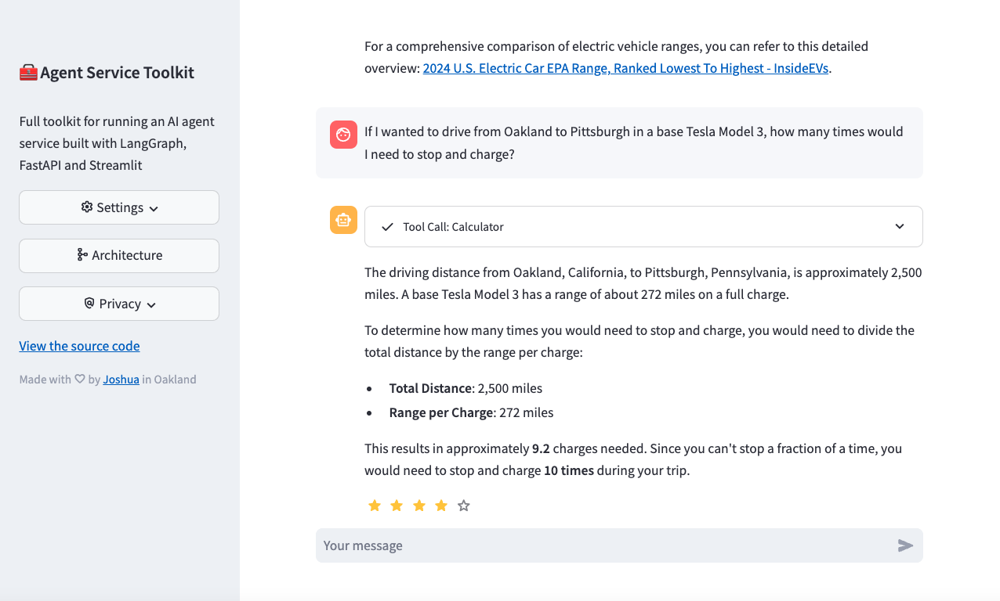

# 🧰 AI Agent Service Toolkit

[](https://github.com/JoshuaC215/agent-service-toolkit/actions/workflows/test.yml) [](https://codecov.io/github/JoshuaC215/agent-service-toolkit) [](https://github.com/JoshuaC215/agent-service-toolkit/blob/main/pyproject.toml)
[](https://github.com/JoshuaC215/agent-service-toolkit/blob/main/LICENSE) [](https://agent-service-toolkit.streamlit.app/)

A full toolkit for running an AI agent service built with LangGraph, FastAPI and Streamlit.

It includes a [LangGraph](https://langchain-ai.github.io/langgraph/) agent, a [FastAPI](https://fastapi.tiangolo.com/) service to serve it, a client to interact with the service, and a [Streamlit](https://streamlit.io/) app that uses the client to provide a chat interface. Data structures and settings are built with [Pydantic](https://github.com/pydantic/pydantic).

This project offers a template for you to easily build and run your own agents using the LangGraph framework. It demonstrates a complete setup from agent definition to user interface, making it easier to get started with LangGraph-based projects by providing a full, robust toolkit.

**[🎥 Watch a video walkthrough of the repo and app](https://www.youtube.com/watch?v=pdYVHw_YCNY)**

## Overview

### [Try the app!](https://agent-service-toolkit.streamlit.app/)

<a href="https://agent-service-toolkit.streamlit.app/"></a>

### Quickstart

Run directly in python

```sh
# At least one LLM API key is required
echo 'OPENAI_API_KEY=your_openai_api_key' >> .env

# uv is recommended but "pip install ." also works
pip install uv
uv sync --frozen
# "uv sync" creates .venv automatically
source .venv/bin/activate
python src/run_service.py

# In another shell
source .venv/bin/activate
streamlit run src/streamlit_app.py
```

Run with docker

```sh
echo 'OPENAI_API_KEY=your_openai_api_key' >> .env
docker compose watch
```

### Architecture Diagram


### Key Features

The LangGraph Agent Service Toolkit provides a robust foundation for building AI agent services using LangGraph. Here's a breakdown of the core components to focus on as you start exploring and customizing the toolkit:

1.  **`src/agents/agents.py`**: This is the central registry for all agents in the service. It defines the `Agent` class, which encapsulates a LangGraph agent ( `CompiledStateGraph`) and its description.  Crucially, it contains the `agents` dictionary where all available agents are defined and linked to their graph implementations (e.g., `chatbot`, `research_assistant`, `command_agent`, `bg_task_agent`).  This is your starting point for understanding how agents are managed and accessed within the service.

2.  **`src/agents/` (subdirectories like `chatbot.py`, `research_assistant.py`, `bg_task_agent/bg_task_agent.py`, `command_agent.py`)**: These files contain the actual LangGraph agent definitions.  Each file represents a different type of agent with specific capabilities.
    *   **`chatbot.py`**:  A very basic chatbot example, demonstrating the simplest LangGraph structure.
    *   **`research_assistant.py`**: A more complex agent showcasing tool usage (web search, calculator) and content moderation. This is a great example to learn from for building more sophisticated agents.
    *   **`bg_task_agent/bg_task_agent.py`**: Demonstrates how to create agents that can run background tasks, showcasing asynchronous operations within LangGraph.
    *   **`command_agent.py`**:  Illustrates how LangGraph can handle conditional logic and command-based routing, useful for creating agents that follow structured workflows.

3.  **`src/core/llm.py`**:  This module is responsible for defining and managing the Language Learning Models (LLMs) used by the agents. The `get_model()` function is key: it handles loading and caching of LLMs based on the `settings.py` configuration.  This is where you'll configure different LLM providers (OpenAI, Azure OpenAI, Groq, Anthropic, etc.) and select which models your agents will use.

4.  **`src/core/settings.py`**: This file defines all the configurable settings for the agent service using Pydantic Settings. It handles loading environment variables from `.env` files and validates configurations.  Understanding this file is crucial for configuring API keys, default models, database settings, and other service-wide parameters.

5.  **`src/client/client.py`**: This file defines the `AgentClient` class, which provides a Python client for interacting with the FastAPI service. It includes methods for invoking agents (`invoke`, `ainvoke`), streaming responses (`stream`, `astream`), sending feedback, and retrieving chat history. This is the component you'll use to build custom frontends or integrations for your LangGraph agents.

6.  **`src/service/service.py`**: This is the FastAPI application that serves the LangGraph agents. It defines the API endpoints (`/invoke`, `/stream`, `/info`, `/feedback`, `/history`) and integrates the agent implementations with the web service. This is the core of the backend service that you deployed with Docker Compose.

7.  **`langgraph.json`**: This configuration file is used by LangGraph Studio for development. It specifies the Python version, dependencies, graph entrypoints, and environment variables for LangGraph Studio.

**Recommended Learning Pathway:**

1.  **Start with `src/agents/chatbot.py`**:  Understand the most basic LangGraph agent structure. Trace the flow from `acall_model` to the `StateGraph` definition and compilation.
2.  **Explore `src/agents/research_assistant.py`**: This is a more feature-rich agent. Focus on how tools are integrated using `bind_tools`, how the `ToolNode` works, and how the agent handles tool calls and responses.  Also, examine the LlamaGuard integration for safety checks.
3.  **Examine `src/agents/agents.py`**: See how the agents you explored are registered and managed.
4.  **Configure LLMs in `src/core/llm.py` and `src/core/settings.py`**:  Experiment with different models and providers by adjusting the settings and the `get_model` function.
5.  **Interact with the service using `src/client/client.py` and `src/run_client.py`**:  Learn how to use the `AgentClient` to communicate with the FastAPI service, both synchronously and asynchronously, and with streaming.
6.  **Run and test the Streamlit app (`src/streamlit_app.py`)**:  Get a feel for how the client is used in a real application.

**Integrating Vector Database:**

To integrate a vector database for your agentic workflow, you would typically modify the agent definitions in `src/agents/`.  Here's a conceptual outline:

1.  **Choose a Vector Database and Langchain Integration**: Decide on a vector database (e.g., Chroma, Pinecone, Weaviate) and install the corresponding Langchain integration library (e.g., `langchain-community` already includes many vector store integrations).
2.  **Initialize Vector Database in `src/core/`**:  Create a new module (e.g., `src/core/vector_database.py`) to handle vector database initialization and connection, similar to how `src/core/llm.py` manages LLMs.  This could involve using environment variables from `settings.py` to configure your database connection.
3.  **Create a Langchain Tool for Vector Database**: In `src/agents/tools.py`, define a new Langchain `BaseTool` that encapsulates interactions with your vector database. This tool could have functions for:
    *   `vector_search(query: str)`:  Searches the vector database based on a query string.
    *   `add_to_vector_database(text: str, metadata: dict)`: Adds text content and associated metadata to the vector database.
4.  **Integrate the Vector Database Tool into your Agent**: Modify your agent definition (e.g., in `src/agents/research_assistant.py`) to:
    *   Import your new vector database tool from `src/agents/tools.py`.
    *   Add the vector database tool to the `tools` list used by your agent.
    *   Modify the agent's LangGraph logic to use the vector database tool within its workflow (e.g., in a node function).

By following these steps, you can effectively leverage the LangGraph Agent Service Toolkit to build and deploy your own custom agentic workflows, enhanced with the capabilities of a vector database. Remember to focus on the core components first to build a solid understanding of the framework.

1. **LangGraph Agent**: A customizable agent built using the LangGraph framework.
1. **FastAPI Service**: Serves the agent with both streaming and non-streaming endpoints.
1. **Advanced Streaming**: A novel approach to support both token-based and message-based streaming.
1. **Content Moderation**: Implements LlamaGuard for content moderation (requires Groq API key).
1. **Streamlit Interface**: Provides a user-friendly chat interface for interacting with the agent.
1. **Multiple Agent Support**: Run multiple agents in the service and call by URL path
1. **Asynchronous Design**: Utilizes async/await for efficient handling of concurrent requests.
1. **Feedback Mechanism**: Includes a star-based feedback system integrated with LangSmith.
1. **Dynamic Metadata**: `/info` endpoint provides dynamically configured metadata about the service and available agents and models.
1. **Docker Support**: Includes Dockerfiles and a docker compose file for easy development and deployment.
1. **Testing**: Includes robust unit and integration tests for the full repo.

### Key Files

The repository is structured as follows:

- `src/agents/`: Defines several agents with different capabilities
- `src/schema/`: Defines the protocol schema
- `src/core/`: Core modules including LLM definition and settings
- `src/service/service.py`: FastAPI service to serve the agents
- `src/client/client.py`: Client to interact with the agent service
- `src/streamlit_app.py`: Streamlit app providing a chat interface
- `tests/`: Unit and integration tests

## Setup and Usage

1. Clone the repository:

   ```sh
   git clone https://github.com/JoshuaC215/agent-service-toolkit.git
   cd agent-service-toolkit
   ```

2. Set up environment variables:
   Create a `.env` file in the root directory. At least one LLM API key or configuration is required. See the [`.env.example` file](./.env.example) for a full list of available environment variables, including a variety of model provider API keys, header-based authentication, LangSmith tracing, testing and development modes, and OpenWeatherMap API key.

3. You can now run the agent service and the Streamlit app locally, either with Docker or just using Python. The Docker setup is recommended for simpler environment setup and immediate reloading of the services when you make changes to your code.

### Building or customizing your own agent

To customize the agent for your own use case:

1. Add your new agent to the `src/agents` directory. You can copy `research_assistant.py` or `chatbot.py` and modify it to change the agent's behavior and tools.
1. Import and add your new agent to the `agents` dictionary in `src/agents/agents.py`. Your agent can be called by `/<your_agent_name>/invoke` or `/<your_agent_name>/stream`.
1. Adjust the Streamlit interface in `src/streamlit_app.py` to match your agent's capabilities.

### Docker Setup

This project includes a Docker setup for easy development and deployment. The `compose.yaml` file defines two services: `agent_service` and `streamlit_app`. The `Dockerfile` for each is in their respective directories.

For local development, we recommend using [docker compose watch](https://docs.docker.com/compose/file-watch/). This feature allows for a smoother development experience by automatically updating your containers when changes are detected in your source code.

1. Make sure you have Docker and Docker Compose (>=[2.23.0](https://docs.docker.com/compose/release-notes/#2230)) installed on your system.

2. Build and launch the services in watch mode:

   ```sh
   docker compose watch
   ```

3. The services will now automatically update when you make changes to your code:
   - Changes in the relevant python files and directories will trigger updates for the relevantservices.
   - NOTE: If you make changes to the `pyproject.toml` or `uv.lock` files, you will need to rebuild the services by running `docker compose up --build`.

4. Access the Streamlit app by navigating to `http://localhost:8501` in your web browser.

5. The agent service API will be available at `http://0.0.0.0:8080`. You can also use the OpenAPI docs at `http://0.0.0.0:8080/redoc`.

6. Use `docker compose down` to stop the services.

This setup allows you to develop and test your changes in real-time without manually restarting the services.

### Building other apps on the AgentClient

The repo includes a generic `src/client/client.AgentClient` that can be used to interact with the agent service. This client is designed to be flexible and can be used to build other apps on top of the agent. It supports both synchronous and asynchronous invocations, and streaming and non-streaming requests.

See the `src/run_client.py` file for full examples of how to use the `AgentClient`. A quick example:

```python
from client import AgentClient
client = AgentClient()

response = client.invoke("Tell me a brief joke?")
response.pretty_print()
# ================================== Ai Message ==================================
#
# A man walked into a library and asked the librarian, "Do you have any books on Pavlov's dogs and Schrödinger's cat?"
# The librarian replied, "It rings a bell, but I'm not sure if it's here or not."

```

### Development with LangGraph Studio

The agent supports [LangGraph Studio](https://github.com/langchain-ai/langgraph-studio), a new IDE for developing agents in LangGraph.

You can simply install LangGraph Studio, add your `.env` file to the root directory as described above, and then launch LangGraph studio pointed at the root directory. Customize `langgraph.json` as needed.

### Using Ollama

⚠️ _**Note:** Ollama support in agent-service-toolkit is experimental and may not work as expected. The instructions below have been tested using Docker Desktop on a MacBook Pro. Please file an issue for any challenges you encounter._

You can also use [Ollama](https://ollama.com) to run the LLM powering the agent service.

1. Install Ollama using instructions from https://github.com/ollama/ollama
1. Install any model you want to use, e.g. `ollama pull llama3.2` and set the `OLLAMA_MODEL` environment variable to the model you want to use, e.g. `OLLAMA_MODEL=llama3.2`

If you are running the service locally (e.g. `python src/run_service.py`), you should be all set!

If you are running the service in Docker, you will also need to:

1. [Configure the Ollama server as described here](https://github.com/ollama/ollama/blob/main/docs/faq.md#how-do-i-configure-ollama-server), e.g. by running `launchctl setenv OLLAMA_HOST "0.0.0.0"` on MacOS and restart Ollama.
1. Set the `OLLAMA_BASE_URL` environment variable to the base URL of the Ollama server, e.g. `OLLAMA_BASE_URL=http://host.docker.internal:11434`
1. Alternatively, you can run `ollama/ollama` image in Docker and use a similar configuration (however it may be slower in some cases).

### Local development without Docker

You can also run the agent service and the Streamlit app locally without Docker, just using a Python virtual environment.

1. Create a virtual environment and install dependencies:

   ```sh
   pip install uv
   uv sync --frozen
   source .venv/bin/activate
   ```

2. Run the FastAPI server:

   ```sh
   python src/run_service.py
   ```

3. In a separate terminal, run the Streamlit app:

   ```sh
   streamlit run src/streamlit_app.py
   ```

4. Open your browser and navigate to the URL provided by Streamlit (usually `http://localhost:8501`).

## Projects built with or inspired by agent-service-toolkit

The following are a few of the public projects that drew code or inspiration from this repo.

- **[raushan-in/dapa](https://github.com/raushan-in/dapa)** - Digital Arrest Protection App (DAPA) enables users to report financial scams and frauds efficiently via a user-friendly platform.

**Please create a pull request editing the README or open a discussion with any new ones to be added!** Would love to include more projects.

## Contributing

Contributions are welcome! Please feel free to submit a Pull Request. Currently the tests need to be run using the local development without Docker setup. To run the tests for the agent service:

1. Ensure you're in the project root directory and have activated your virtual environment.

2. Install the development dependencies and pre-commit hooks:

   ```sh
   pip install uv
   uv sync --frozen
   pre-commit install
   ```

3. Run the tests using pytest:

   ```sh
   pytest
   ```

## License

This project is licensed under the MIT License - see the LICENSE file for details.
